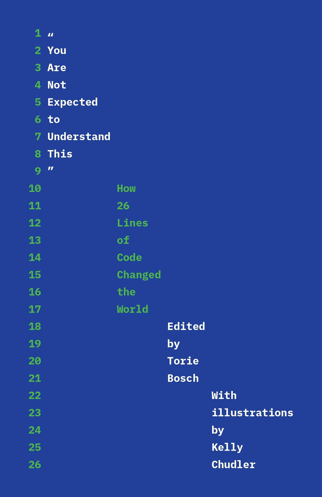

# "Close to the Machine": How Ellen Ullman's books inspired me as a (technical) writer

[Ellen Ullman](https://en.wikipedia.org/wiki/Ellen_Ullman) is one of the very rare author capable of depicting accurately what it means to build software. I am no software engineer, but having been working for fifteen years in the industry close to technical teams, I definitely find her books to be one of the rare accurate perspectives on the matter.

<figure><figcaption>
"Close to the Machine" book cover - By Ellen Ullman
</figcaption></figure>

### A unique perspective

Ullman's work finds itself at the crossroads of personal memoirs and non-fiction. I am referring to mainly two of her books: "**Close to the Machine: Technophilia and its Discontents**" (1997), and "**Life in Code: A Personal History of Technology**_" (_&#x32;017), but also to contributions she made to collective publications such as "**You are not expected to understand this - How 26 lines of code changed the world**" (2022) and "**Resisting the Virtual Life: The Culture and Politics of Information**" (1995).&#x20;

Ellen Ullman's perspective is one from within. She started working as a consultant software engineer in the late 1970s in the Silicon Valley. Her exceptional position as one of the very few women in this field at this time, combined with her writing skills and talent for philosophical reflection on technology, has led to exceptional books still very much relevant today.&#x20;

Even more exceptional is the combination of her appetite for writing with an engineering career. My entire profession - technical writing - exists along engineers for the sole purpose of relieving them from the burden of documenting what they are building. It is even a running joke to say that engineers love technical writers as much as they hate writing themselves.

Ellen Ullman defeats those standards. In her work, she captures both the ambiguous relationship of tech people with their own machine, but also what programming as a career is doing to the perception of time, of space, of money, of success, of society.

### "The willingness to fail all the time"

As a person who had to code herself and solve real-life coding problems, Ullman is also one of the few able to tell what coding is without falling into the classic clichés we see in most novels (I do not recommend the novel "**Python**", by Nathalie Azoulai, for instance).&#x20;

Ullman describes the "**willingness to fail all the time**" required to be a successful programmer, as much as she acknowledges how stupid the machines are, how radically stupid even. Coding being a pure work of the mind, it requires isolation, silence, it is a purely logical experience. It places those who code into a time space that is not the one of the present, the interactions or the small talk. They operate remotely from the human world, in a  machine universe.

Ullman also describes well how the act of coding can be extremely satisfying. All developers chase that "high" of seeing exactly how they are going to proceed. This is only followed by - as the projects move along - dozens of imprecision, of human errors, of slight misunderstandings, that lead to the endless loop of bug fixing, of sleepless nights over a service that is down and nobody knows why. (Sometimes it works and nobody knows why either).

Ullman captures very well in her memoirs also what the **asynchronous** **nature of software development** is, and how it has become a new model of society now that we can order anything anytime from anywhere from our phones. Places and times don't have meaning anymore. The only thing that matters is that "it has to work" for the flows of the world to continue without disruption. We all go on with our lives, unaware of the complexity, and fragility, of all the underlying systems all our other systems depend on.&#x20;

<figure><figcaption>
"Life in Code" book cover, by Ellen Ullman
</figcaption></figure>

### Really close to the Machine

One of her big idea, at the core of the expression "**Close to the Machine**" is to show how the technical professions are "ranked" by level of prestige in relation to how "low" or "high" the code being written is. She describes the "low" code as code meant for machines, not people. "High" code is for people, i.e. used to build interfaces making it easier for users to interact with the machine, but those interfaces mostly hide the underlying complexity of the system. "Low" would be how server communicate with each other, and even as low as Assembly Language Programming (programming by "talking" to the CPU directly). The lowest it gets, (the closer to the Machine), the more competitive, masculine and elitist it becomes.&#x20;

Us, technical writers, are considered by "the elite of programming" (people being very "low") by not even being technical people at all. It is very important to understand this social dynamic to understand who the tech most advanced R\&D people and founders (people creating the systems all the others rely on) are, and how they view all the people working around them as "bottom of the food chain". I believe this is still very true today. Most of the people even working in the tech industry will never get "low" enough to encounter this very different, very elitist crowd making big decisions impacting us all.

<figure><figcaption>
"You are not expected to understand this" book cover with an "Introduction" by Ellen Ullman
</figcaption></figure>

### Reading to be able to write

Discovering Ellen Ullman's work has helped me envision the kind of book I wanted to write. I have been writing for years, taking notes here and there around my life as a technical writer, reflecting on various aspects of the software-making world, but I couldn't find a genre that would fit.

Ullman was the only example I could find of a deep philosophical approach, technically accurate, that is also embodied into a personal (relatable) life-story, one of a woman in tech fifty years ago living in San Francisco. Her wider reflections on the decline of the Internet, and the political implications of technology as it evolved towards a centralized, capitalistic power, makes her one of the most relevant voices, still today.

***

### More about Ellen Ullman's work

"Talks for Google" full interview of Ellen Ullman in 2017 about "Life in Code": [https://www.youtube.com/watch?v=bCcVyuq9aRE](https://www.youtube.com/watch?v=bCcVyuq9aRE)&#x20;

A lighter Youtube review of the book "Close to the Machine": [https://www.youtube.com/watch?v=gwxYrUwWgJE](https://www.youtube.com/watch?v=gwxYrUwWgJE) by the book reviewer Chareads

"Ellen Ullman’s New Book Tackles Tech’s Woman Problem", article in the New York Times: [https://www.nytimes.com/2017/08/17/books/review/life-in-code-ellen-ullman-memoir.html](https://www.nytimes.com/2017/08/17/books/review/life-in-code-ellen-ullman-memoir.html)

