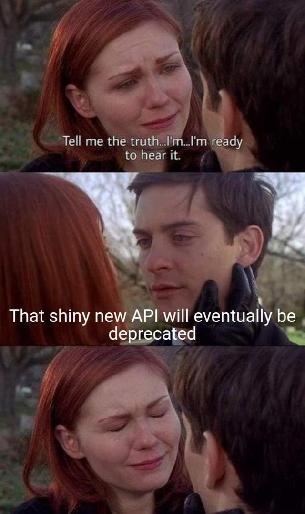
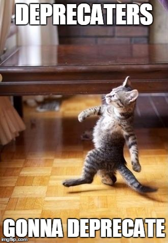
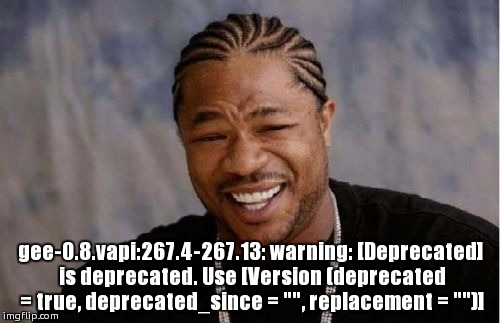

# Documenting API Endpoint Deprecation: the Art of Planning Ahead

As a freelance software technical writer, I usually spend between half and a third of my time to care for API documentation, depending on the project and the company I am working for.&#x20;

This can go from testing endpoints one by one to adjusting the endpoint classification in the documentation, enriching endpoint descriptions, renaming the endpoints to be understood by human beings, enriching parameter's descriptions, writing changelog posts, writing error messages, anticipating changes coming in the next version of the API, writing API guides, etc.


API stands for Application Programming Interface. Think of API as programs that take an input, and delivers an output (usually, as a JSON file to structure the data and make them readable by a machine). APIs allow systems to communicate with each other and are pretty much present behind all our phone apps, and web apps.&#x20;

For a very accessible guide explaining "What is an API?", I recommend visiting [this page](https://read.technically.dev/p/whats-an-api) on the site "Technically".


<figure><figcaption><p>You'd be surprised at how many API deprecation-related <br>memes there are out there.</p></figcaption></figure>

APIs are so critical to business growth those days, they usually evolve fast, which implies a constant stream of new endpoints to document as well as ancient endpoints being deprecated. Deprecating an endpoint means it will stop working in a close future, so the users need to be redirected to another way to perform the same task.&#x20;

***

### <mark style="color:purple;">Why deprecate?</mark>

What does an API have to do to be punished that way?

There are several reasons for deprecating endpoints, which include but are not limited to:

* [x] **Technical debt**\
  Companies sometimes choose to strategically deprecate endpoints relying on an outdated structure, often for performances reasons. Dated systems can get harder and harder to properly maintain as time passes.&#x20;
* [x] **Decrease in usage**\
  Sometimes a feature that used to be very much 'in demand' becomes less popular. It can come from clients 'churning' (turning to competitors), but also from the evolution of the market for specific needs. If an endpoint usage is significantly decreasing, it might be wise to decide to deprecate it to focus the resources on other endpoints providing more value.
* [x] **Security issues**\
  Security protocols and techniques, including cryptographic algorithms, evolve quickly. Endpoints relying on dated protocols that are not considered 'safe' anymore might expose the API users to security risks, and should be deprecated to be replaced by more secure ones.
* [x] **Performance reasons**\
  This can go along with technical debt issues. If requests are long to process, or the endpoint provides a full dataset in response instead of a specific set of data (or both), it is best to deprecate it to provide more specific, efficient options.
* [x] **Business pivot**\
  Among the many reasons for deprecating endpoint is the rare - but possible - business pivot or strategical change of product, which brings a company to build new APIs entirely, or to repurpose some endpoints to perform some entirely new tasks.

***

### <mark style="color:purple;">The process of API Versioning (and Deprecating)</mark>

Deprecation are rarely discussed in isolation: they are part of the API roadmap and versioning plan, just like the introduction of new endpoints or changes to existing ones.

> "Versioning is always a compromise between improving developer experience and the additional burden of maintaining old versions." - Brandur Leach, talking [about Stripe API versioning](https://stripe.com/blog/api-versioning).

Every company has its own process, but it usually follows those general steps:

* [x] **Strategic Prioritization**\
  Product & technical lead(s) craft the next version's priorities, to better balance user's needs with technical constraints and business goals.\

* [x] **Collaborative Design**\
  Once the priorities are clear, the roadmap is transferred to an API team, usually composed of senior technical profiles (engineers and architects) who define the structure and design guidelines. It is usually the stage where technical writers are involved, so we can start documenting the changes to come (_note that I have been asked before to prepare a deprecation notice within 24 hours before the actual deprecation, so anything can happen, but I would not recommend_).\

* [x] **Validation**\
  Depending on the criticality of the changes, the new API has to be approved by a technical board, and sometimes by executives as well. Legal can be involved too, if applicable.\

* [x] I**mplementation & Documentation**\
  That is when the actual changes are made to the API, that changes version (from 1.0 to 2.0 for instance). The chosen endpoints are deprecated, new ones might be added too. This is the perfect moment to update the API documentation, write migration guides, and craft deprecation notice pages and warning messages.\

* [x] **Communication**\
  As the release of the new version occurs, there should be emails sent to clients, as well as announcements (internal and external). A changelog should list all the changes and be easily accessible in the documentation.

<figure><figcaption></figcaption></figure>

***


## <mark style="color:purple;">How to Document Deprecations</mark>

### <mark style="color:purple;">Show the Deprecation Timeline</mark>

Craft a release note to be sent, and a "deprecation" page for the documentation that lists all the coming changes, and especially clarifies **the dates** at which each endpoint will be fully deprecated. \
The content needs to be reviewed and validated by the API team (if any), and/or by Product, before publication, so it is wise to start working on those content as soon as the list of deprecated endpoints is available.


Deprecations need to be announced in advance to give enough time to the users to adjust. I'd recommend at least three months, a semester, or even a year being better for very popular and/or complex endpoints.


### <mark style="color:purple;">Publish Migration guide(s)</mark>

Write migration guides if there are new alternatives to the deprecated endpoints.&#x20;

This will ensure that users can transition smoothly to new endpoints without any service interruption. If there will be no alternative provided, this needs to be stated in the documentation in a very clear manner, explaining why (business pivot, technical issue, etc.).&#x20;

The guides need to be published long enough before the actual deprecation to give time to users to adjust. Don't be afraid to be proactive with emailing, either.

### <mark style="color:purple;">Update the Open API Spec</mark>

The Open API Spec could always use a check to make sure the mention "deprecated" is present where it should be.

This is usually a '`deprecated`' property added to the endpoint, set as '`true`'. It is useful to mention the coming deprecation in the endpoint description as well.

```yaml
paths:
  /example:
    get:
      summary: Fetch an example resource
      description: This endpoint retrieves an example resource. It is deprecated and will be removed in the next version.
      deprecated: true

```

### <mark style="color:purple;">Check for Deprecation Notices within the code</mark>&#x20;

Developers often add warnings into the code of the API, which will display a deprecation notice in the header of the request (for REST API). Those are called the Deprecation and the Sunset headers.

#### **The Sunset Header (**[**RFC 8594**](https://www.rfc-editor.org/rfc/rfc8594)**)**

The Sunset HTTP response header field allows a server to communicate the fact that a resource is expected to become unresponsive at a specific point in time. The Sunset header contains a single timestamp which advertises the point in time when the resource is expected to become unresponsive.

The Sunset Header is a standardized way to announce deprecation, which is one of the most efficient way to proceed.

```
HTTP/1.1 200 OK
Sunset: Sat, 01 Jan 2024 00:00:00 GMT
```

***

#### The Deprecated directive (for GraphQL)

For GraphQL APIs, it is possible to use the `@deprecated` directive in the schema to mark fields or queries as deprecated, optionally including a message.

```graphql
type MyType {
  id: ID!
  oldField: String @deprecated(reason: "oldField is deprecated. Use newField instead.")
  newField: String
  deprecatedField: String @deprecated
}
```

***

#### **Deprecation notice in the response**

Independently of the header, developers can also add a deprecation warning in the response body of the HTTP request, saying the endpoint will be deprecated soon.&#x20;

As a technical writer, you can give it a test, and mention it to the technical teams if you see those are missing. You can also contribute to crafting the warning messages so they are standardized across all channels.&#x20;

```json
{
  "data": {...},
  "warnings": [
    {
      "code": "DEPRECATED_ENDPOINT",
      "message": "This endpoint is deprecated and will be removed on 2024-01-01. Please use /new-endpoint instead."
    }
  ]
}

```

***

## <mark style="color:purple;">So, what's the best way to proceed?</mark>

The best course of action is definitely to combine all of the above:

* Working on a release note in advance and sending it by email several times as the deadline approaches (once way early, once a month before sunsetting, and a final warning a week before)
* Having a deprecation timeline page in the documentation that is easy to find (emails can point towards it for more details) and that remains there at all times,
* Publishing migration guides in advance, providing users with alternative options to perform the task they need to perform,
* Having warnings embedded in the API code through the Sunset Header (for REST APIs) and using the @Deprecated directive for GraphQL APIs,
* Once the endpoints are deprecated:
  * Marking those endpoints as deprecated in the Open API Spec,
  * Having warnings in the JSON responses stating the endpoint is deprecated,
  * Adding links to the relevant migration guides and/or alternative endpoints in the Open API spec endpoint description.


Finally, I would consider waiting on deleting the deprecated endpoints code once they are officially deprecated (I know, its hard). But there might always be a few clients relying on those who missed the warnings! Having a backup for those guys might come handy, even if it is just to delay the sunsetting of a few months.


<figure><figcaption><p>Also, maybe avoid deprecating all the good options at once :)</p></figcaption></figure>


