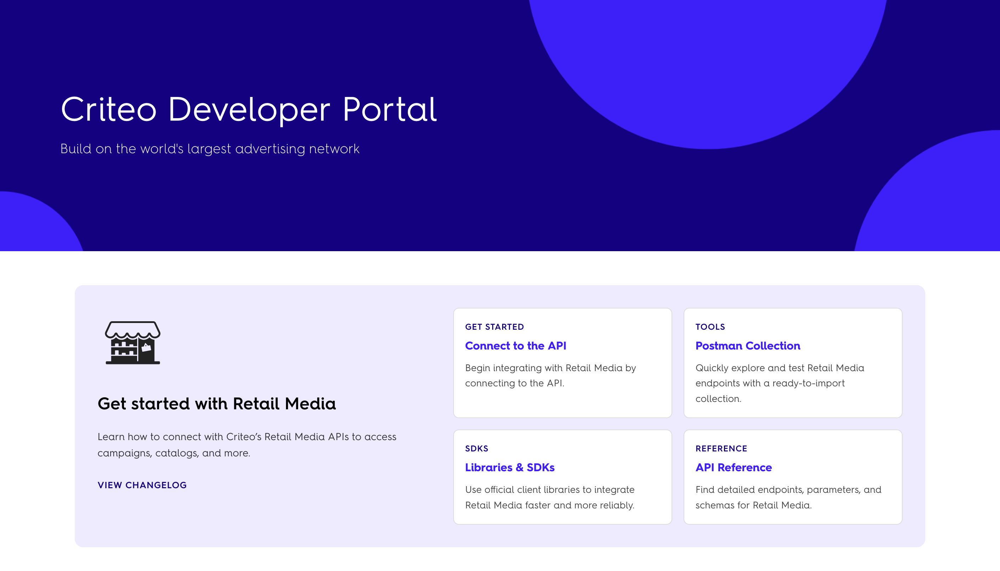

# "Readme Refactored": Exciting New Features for Documenting APIs Coming in 2025

## <mark style="color:purple;">What is Readme.com?</mark>

[Readme.com](https://readme.com/) is one of the most popular CMS out there to build developer portals. It features interactive API references, guides, recipes, changelogs and more.&#x20;

It is very easy to use for non-technical people (everything can be set up and edited from a quite straightforward back-office space), and provides a few interesting features such as:

* [x] an interactive API Spec display (where users can perform live tests),
* [x] a built-in glossary,&#x20;
* [x] a search function,&#x20;
* [x] a "suggest edit" feature,
* [x] a solid versioning tool,&#x20;
* [x] a reusable content feature, etc.

I have used Readme for about half of the projects I have worked on as a freelance technical writer, and for most companies I find it to be a very good fit to manage large groups of users, multiple projects, as well as massive amounts of pages and big API specs in one back-office.

Yet, Readme was not - so far - made for docs-as-code processes. It did not allow synchronizing with GitHub, so all edits had to be made through the back-office itself (where sometimes people struggle to log into), and there was no simple option to have a back-up on GitHub or to download the documentation's content all at once.&#x20;

Good news, Readme.com announced a bunch of new exciting featured to come in 2025, which I look forward to having available for my clients, and for me in my daily tasks.&#x20;

It is called "Readme Refactored", and below is a breakdown of the most exciting changes to come.

***

## <mark style="color:purple;">Readme new features announced (+ demo screenshots)</mark>



While not thrilled by the use of a live animal to perform this awkward announcement ceremony, I was by the following features.

### <mark style="color:purple;">Editing & Viewing from the same interface</mark>

All changes can now be done from one single interface (instead of having to go back and forth between the back-office and the front). This means the switch is easy and fast, whether you need to quickly fix a typo or edit a full section of the page. It can all happen in the same tab.

<figure><figcaption>
The "View mode"
</figcaption></figure>

<figure><figcaption>
The "Edit" mode
</figcaption></figure>

***

### <mark style="color:purple;">MdX Editor</mark>

The editor is now MdX instead of Markdown, which means we can now incorporate interactive components in the content of pages such as cards, interactive tabs, etc.&#x20;

Readme were kind enough to provide three built-in components: accordion, cards, columns and tabs - but we can add custom ones too. Those add a bit of visual and interactive diversity to the content of the pages that were - so far - pretty basic.&#x20;

<figure><figcaption>
The MdX components in Readme Refactored
</figcaption></figure>

I am already excited to redo all the introductory / overview pages of all the sections of the docs, using the clickable cards to make navigation a little more sexy than just a bullet point list.&#x20;

Columns are a nice addition too to format pages in a more diverse way. Tabs will make it easier to display language-dependent technical information or code snippets. I like using accordion for troubleshooting tips or specific instructions for a sub-use-case, without adding too much length to the main content.

***

### <mark style="color:purple;">Synchronization with GitHub</mark>

One very exciting news is the possibility to soon be able to **connect with a GitHub account** and to synchronize with it. From what I have seen in the video launch, it will be possible to edit in Readme and to automatically update the content on GitHub, and the other way around as well. This is great to provide flexibility: technical people usually prefer to edit through GitHub, so now they have the option.&#x20;

<figure><figcaption>
The Git Connection beta feature
</figcaption></figure>

It is also great for back-up, because to be honest, I never felt comfortable relying 100% on Readme for all our technical content. I mean, if their server was to be down tomorrow, most of my client's would be in deep trouble (and so would I).

***

### <mark style="color:purple;">Embedding API keys & variables</mark>

* Copilot extension to write API code directly in the code editor (in beta)
* Embedded API keys within the API reference interface to help with faster connection / testing&#x20;
* Detailed logs of people who used the API through Readme (MyDeveloper)

