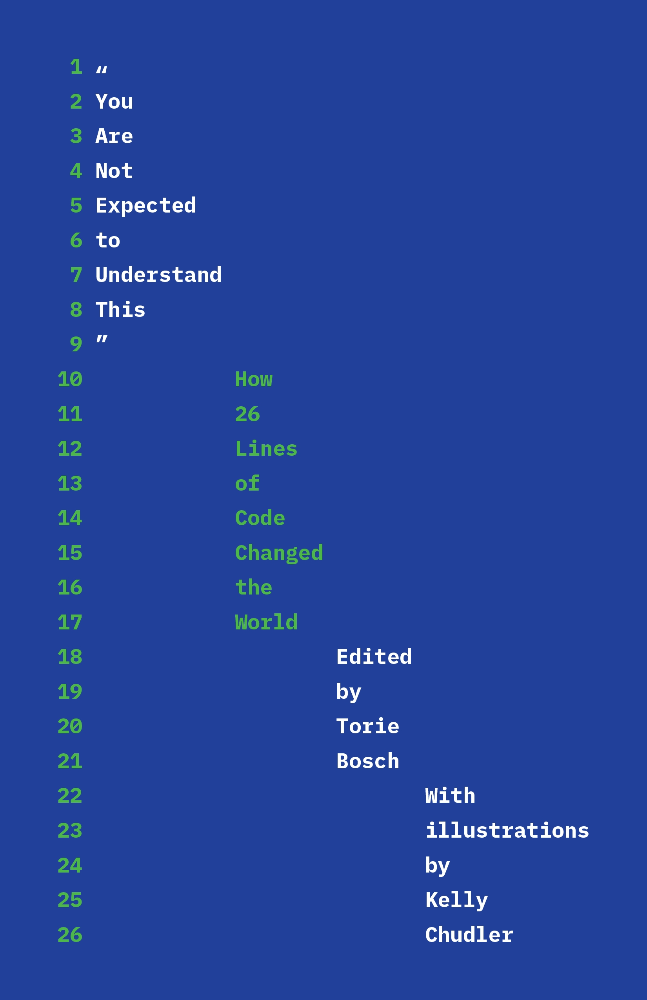
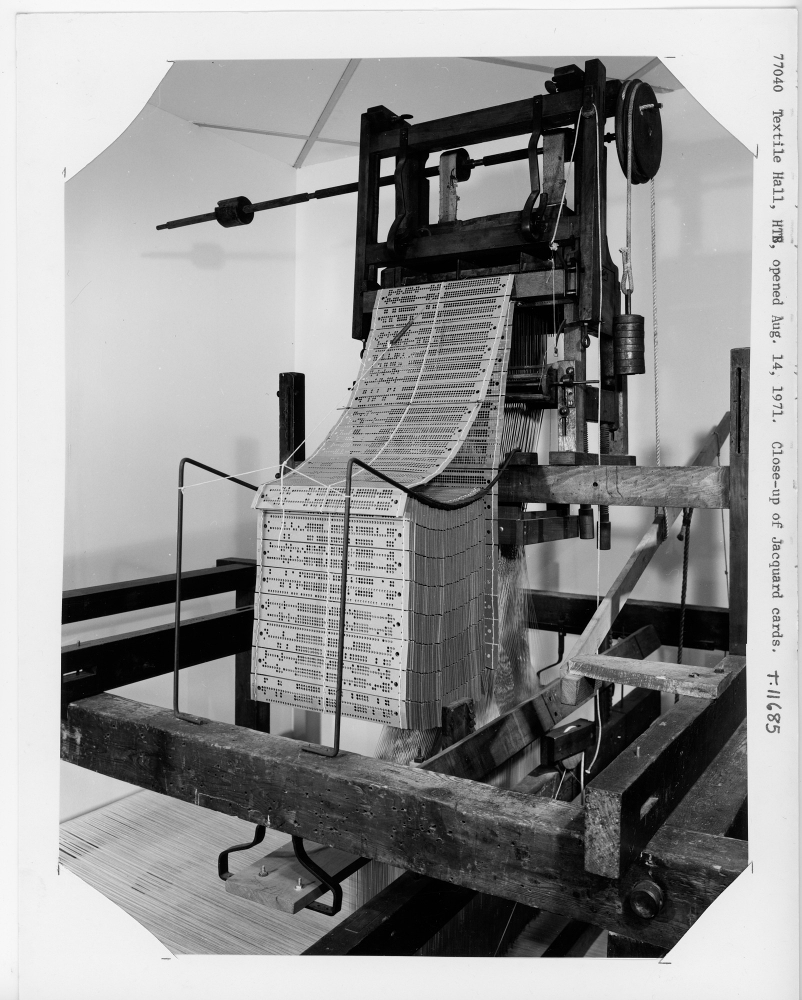

# "You Are Not Expected to Understand This" - 26 Stories Telling the History of Code

In this essay called "**You Are Not Expected To Understand This, How 26 Lines of Code Changed the World**", editor Torie Bosch puts together 26 stories from engineers, historians, writers, journalists about critical moments of the programming history.

By its simplicity and format (each story is 4 to 8 pages long), featuring naive illustrations by Kelly Chudler, the book is accessible to a wide audience of non-specialists and tech-savvy alike, which is something I truly appreciate. Since I started my quest for good, accessible books about the world of software, I realized there is a bit of a whole in a category that brings together "easy read" and "technically rigorous". "**You Are Not Expected to Understand This**" is a great demonstration that it is possible to achieve both.

<figure><figcaption>
Book cover of "How 26 Lines of Code Changed the World"
</figcaption></figure>

Depending on  your interests, you can find in the book compelling stories about the BASIC language, how email was invented, the pop-up window tragedy, how Telegram became the Internet in Iran, but also discover about the first program encoded into punched-card, how crypto activists printed code on T-shirts to defend the right to freely encrypt, the invention of the "like" button and how it revolutionized social media, the history of IRC (Internet Relay Chat) and hyperlinks, the history of the JPEG image format, stories about space robots and the Volkswagen emission scandal.

I won't talk about the 26 of those great stories here, but will focus on one I particularly liked, also because I am a bit obsessed with the history of **punched cards** and early ages computing from the 1940s.

I encourage you to give this book a try, for a short read or a long one, you will always get a chance to learn something. It also features a great introduction by Ellen Ullman, [my favorite a](https://tech.annelaurefreant.xyz/blog/close-to-the-machine-how-ellen-ullmans-books-inspired-me-as-a-technical-writer)[uthor on coding and the software industry.](https://tech.annelaurefreant.xyz/blog/close-to-the-machine-how-ellen-ullmans-books-inspired-me-as-a-technical-writer)&#x20;


_"You need the willingness to fail all the time". This words guided me throughout all the years when I worked to become a decent programmer, as they no doubt guided countless others. That one sentence reminded us that coding is a life in which failure will be your constant shadow. Bugs, crashes, halts, glitches, hacks: programmers who want to survive in the profession (...) must come to a begrudging acceptance of failure as a cofounding helper, an agent of destruction you wish you could evade, but never can_.&#x20;

&#x20;        — Ellen Ullman (introduction of "_You Are Not Expected to Understand This_")


***

### The First Line of Code - by Elena Botella

This is the very first story of the book, perhaps due to its historical nature that explores a time before modern days computing. It questions the very definition of code before computers:


"_Code happens when you have a machine that's ready to listen to not just one instruction, but very long sets of instructions, combining those "on" or "offs", "1s" or "0s", "dos" and "do nots" in pratically infinite, seemingly magical combinations. And importantly, (...) code should always produce the same output given the same input"._


Botella tells the story of Basile Bouchon, a French weaver, who was one of the first "programmer" when he invented the first punched card program for looms to weave patterns as early as 1725. The "card" was a long sheet of paper encoded by punching a series of holes in it. The sheet was then placed underneath a row of needles, the "wholes" telling which needle to retract and which not to retract to weave the desired pattern.&#x20;

The process was a purely mechanical machine at the time. Joseph Marie Jacquard became famous in the early 1800s, reusing the same principle to manufacture the "Jacquard loom" at an industrial scale. From there, early computer sciences pioneers such as Ada Lovelace and Charles Baggage laid the first blueprint for the first computer in 1837 called the Analytical Engine.

<figure><figcaption>
Picture of a Jacquard loom machine (Smithsonian Museum)
</figcaption></figure>

Botella explains that this machine was never built (the Analytical Engine) because it would have required an enormous amount of materials and electrical power. Yet it served as a stepping stone for further innovation.&#x20;


_"(...) Turing (later) explained what made a computer a computer: the ability to perform absolutely any computation. (...) The machine did need to have three things: a 'store' or memory to keep track of data, an 'executive unit' to carry out operations, and a 'control' or set of instructions - in other words, code. Both the data in memory and the code could be described (...) as sets of numbers (0s and 1s), just like the binary of Bouchon's perforated paper roll."_


In 1889, the German immigrant Herman Hollerith wrote his doctoral thesis at Columbia University, explaining "how to use punch cards to more quickly compute data. His system was used by the US Census Bureau to complete the 1890 census, cutting down the required amount of computation time by at least six years." He then founded the **Tabulation Machine Company**, which became known later as **IBM**.

One could look at the punch card invention as one of the concept of binary (0s and 1s), which makes it a central artifact in the history of computing, directly linked to the building of early computing machines.&#x20;


"When computers became electronic, these 0s and 1s reflected the presence or absence of an electric signal".


It's interesting to note that Botella emphasizes at the end of her text the link between music and the idea of the punch card or of "early day programs". Indeed, music, and especially automated instruments like mechanical pianos and organs, have been using "programs" made of punch cards since even before the Jacquard's loom.

***

