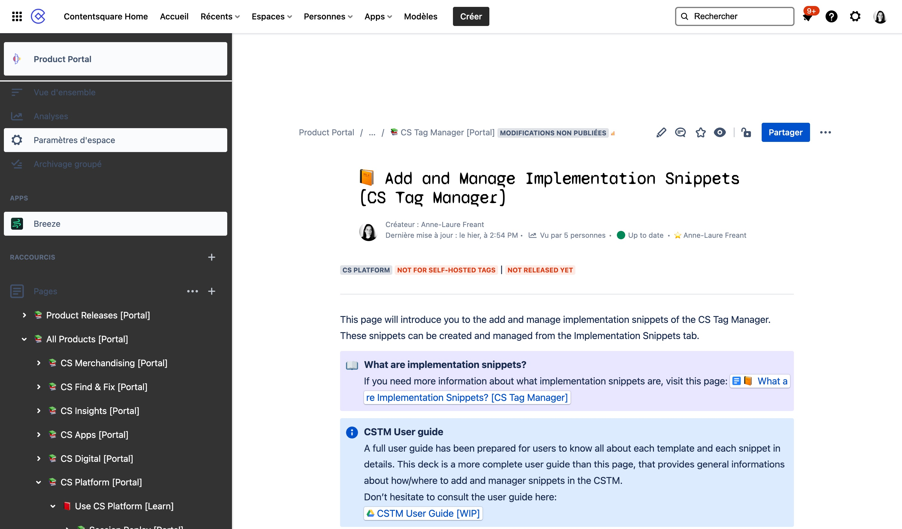
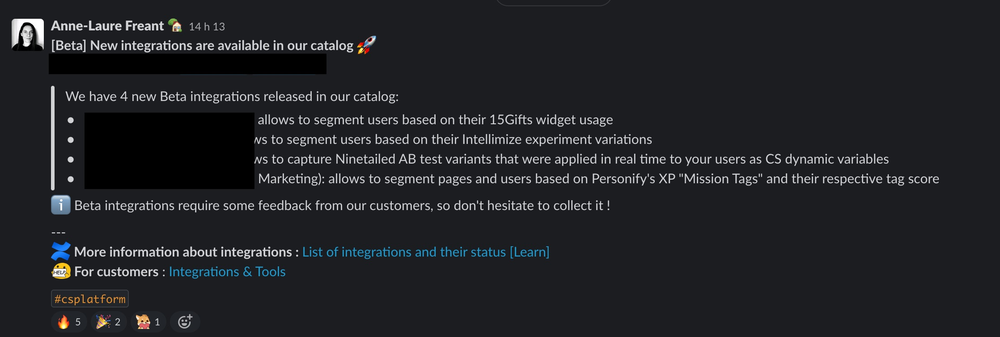

# 🟪 ContentSquare Internal Doc

I joined the[ Contentsquare](https://contentsquare.com/) knowledge management team from August 2022 to March 2023 for a 6-month full-time contract. Contentsquare is a digital experience platform (DXP) providing online businesses with precise insights into their customer's online behavior and user experience.

I was part of the Knowledge Management - Product team, in charge of updating and maintaining the product's internal knowledge base in Confluence along with 5 other technical writers.

My scope encompassed product foundations (APIs and integrations, tag manager, data pipeline) and a few product features (Journey Analysis, Zoning...).&#x20;

The workflow involved regular meetings with product owners, handling tickets for documentation updates or creation, managing the reviewing process, and internal release notes on Slack.

<figure><figcaption>
Screenshot of one (of many!) article I worked on, in the Confluence Knowledge Base
</figcaption></figure>

<figure><figcaption>
Screenshot of one of the product release note I posted on the Contentsquare's Slack
</figcaption></figure>
