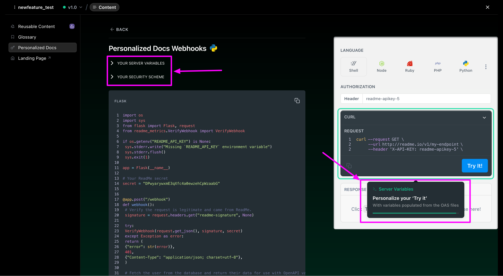

# 🟠 Criteo Developer Portal

I have started a full-time contract for the Ad Tech company Criteo in July 2024. I since became a full-time employee in Barcelona (Spain) in September 2025.

After spending the first six months revamping outdated/not standardized content on the Retailer Integration & Retail Media API documentation, and ramping up on Criteo's tools and industry, I progressively took the lead of [the developer portal](https://developers.criteo.com/).

I now own the roadmap of Criteo’s developer portal for Retail Media API & Retailer Integration, working in coordination with Product, R\&D, APIDX, GTM and Ops on a highly technical, rapidly evolving product & industry (Retail Media).

* My achievements so far:
  * I took the initiative to redesign & implement a new developer portal landing page as the current one was outdated and not optimized for technical users (using Codex) ([Github repo here](https://github.com/annelaure-blog/homepage_test)),
  * I implemented the first Technical writing framework & roadmap at Criteo with all the content formatting, technical content automation and prompts, processes and governance rules,
  * I designed and implemented a strategy to standardize API content automation to free some tech writing resources for cookbooks creation. To do so, I used Codex to develop scripts that generate standardized guides from our Open API Spec files, and automate all endpoints testing to generate up-to-date responses examples.
  * I successfully coordinated the migration of our entire external technical documentation to Readme Refactored, 
  * I am currently investigating & testing along with Product & R\&D docs' optimization for LLM & MCP.

<figure><figcaption></figcaption></figure>

