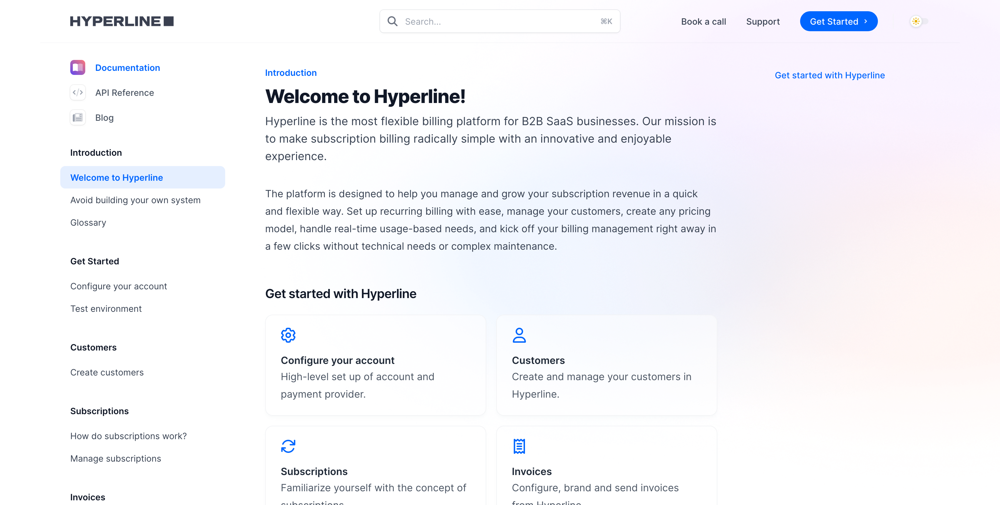

# 💵 Hyperline User Documentation

[Hyperline](https://www.hyperline.co/) is on a mission to make billing for B2B Saas "radically simple". Its platform allows to work with a wide range of pricing model, subscription duration and specific parameters to ensure a smooth, fully automatized and integrated billing experience.

We are starting this project from the existing documentation on Read.me, mostly dedicated to technical users. From there, we are building a more exhaustive and accessible user center that will help all users to find their way autonomously in Hyperline as the product develops.\
\
The new documentation is available here: [https://docs.hyperline.co/docs/introduction/welcome](https://docs.hyperline.co/docs/introduction/welcome)

\
_**Tools: Notion, Mintlify, Markdown**_

<figure><figcaption>
The new Hyperline documentation
</figcaption></figure>

<figure><figcaption>
Hyperline original documentation
</figcaption></figure>

